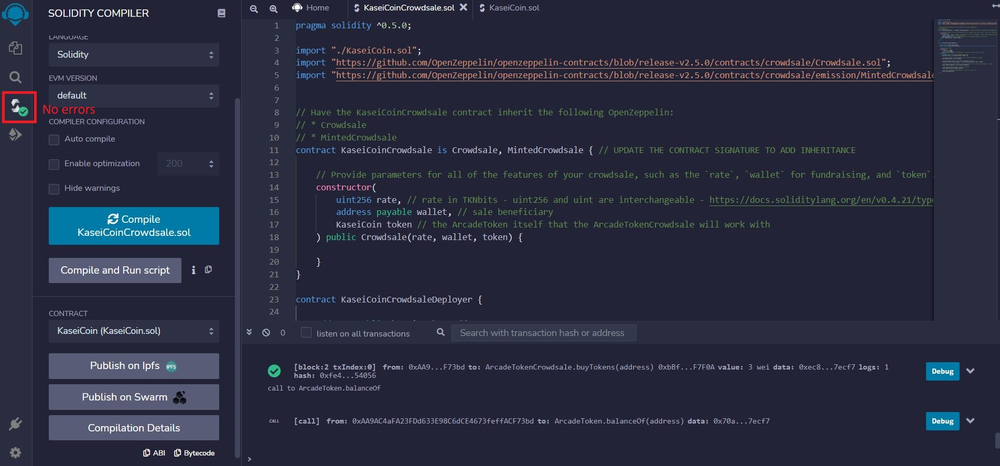
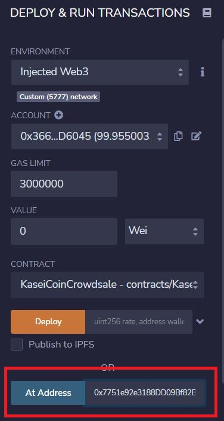
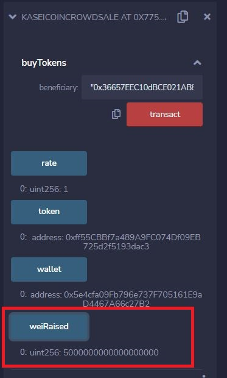

<!-- Find and Replace All [repo_name] -->
<!-- Replace [product-screenshot] [product-url] -->
<!-- Other Badgets https://naereen.github.io/badges/ -->

[![Contributors][contributors-shield]][contributors-url]
[![Forks][forks-shield]][forks-url]
[![Stargazers][stars-shield]][stars-url]

# KaseiCoin-Crowdsale

This repository represents a fungible token that is ERC-20 compliant and that will be minted by using a Crowdsale contract from the OpenZeppelin Solidity library.
The contract allows user manage the entire crowdsale process, allowing users to send ether to the contract and in return receive KaseiCoin tokens.
Contract mints the tokens automatically and distributes them to buyers in one transaction.

---

## Technologies

This project leverages the following tools for financial analysis:

- [Solidity](https://docs.soliditylang.org/en/v0.8.13/) - programming language for implementing smart contracts.

- [Remix IDE](https://remix.ethereum.org) - Remix IDE allows developing, deploying and administering smart contracts for Ethereum like blockchains.

- [TruffleSuite - Ganache](https://trufflesuite.com/ganache/) - a personal Ethereum blockchain.

Solidity version:

```
pragma solidity ^0.5.0
```

OpenZeppelin libraries:

```
CrowdSale:

import "https://github.com/OpenZeppelin/openzeppelin-contracts/blob/release-v2.5.0/contracts/crowdsale/Crowdsale.sol";
import "https://github.com/OpenZeppelin/openzeppelin-contracts/blob/release-v2.5.0/contracts/crowdsale/emission/MintedCrowdsale.sol";

ERC20 token:

import "https://github.com/OpenZeppelin/openzeppelin-contracts/blob/release-v2.5.0/contracts/token/ERC20/ERC20.sol";
import "https://github.com/OpenZeppelin/openzeppelin-contracts/blob/release-v2.5.0/contracts/token/ERC20/ERC20Detailed.sol";
import "https://github.com/OpenZeppelin/openzeppelin-contracts/blob/release-v2.5.0/contracts/token/ERC20/ERC20Mintable.sol";
```

---

## How to run

### Step 1 - Install Ganache

Pls, download and install `Ganache` from `https://trufflesuite.com/ganache/`

### Step 2 - Install and Configure the wallet Metamask

Pls, download and install wallet Metamask from `https://metamask.io`

Configure the Metamask:

- copy `private` account keys from Ganache and import them to create the Accounts


- configure network like on the screenshot


### Step 3 - Open the smart contracts in the Remix IDE


Inject the testing account from the Ganache:


Confirm injection:


### Step 4 - Compile and deploy `Deployer contract`

- compile smart contracts:

`KaseiCoin:`


`KaseiCoinCrowdsale and KaseiCoinCrowdsaleDeployer:`



`Deploy Deployer`

Pls, select and provide:

- deployer contract;

- NAME of Coin (Kasei);

- SYMBOL of Coin (KAS);

- WALLET (any valid address).


Click on `Transact` and confirm transaction in the Metamask


Check transaction in the Ganache:


Account balance:


### Step 5 - Link the contract's addresses to the Remix

First use functions under CrowdSaleDeployer for taking contract's addresses:

`CrowdSale` contract


`KaseiCoin` contract


Second put addresses to `At address` field for linking contracts:




Finally contracts and their functions are got available for testing:


and


### Step 6 - Interact with contracts

Try to buy tokens. Input value and address:

In my case Value is `5 Ethers`.


Confirm with Metamask:


Check transaction in the Ganache:


and with function `balanceOf` check balance associated with testing account(s)


View the total supply of minted tokens:


View the amount of wei that has been raised in the crowdsale contract:



---

## Contributors

Glupak Vladislav [Linkedin](https://www.linkedin.com/in/vladislav-glupak/)

<!-- MARKDOWN LINKS & IMAGES -->
<!-- https://www.markdownguide.org/basic-syntax/#reference-style-links -->

[contributors-shield]: https://img.shields.io/github/contributors/VladislavGlupak/Blockchain-based-ledger-system.svg?style=for-the-badge
[contributors-url]: https://github.com/VladislavGlupak/Blockchain-based-ledger-system/graphs/contributors
[forks-shield]: https://img.shields.io/github/forks/VladislavGlupak/Blockchain-based-ledger-system.svg?style=for-the-badge
[forks-url]: https://github.com/VladislavGlupak/Blockchain-based-ledger-system/network/members
[stars-shield]: https://img.shields.io/github/stars/VladislavGlupakBlockchain-based-ledger-system.svg?style=for-the-badge
[stars-url]: https://github.com/VladislavGlupak/Blockchain-based-ledger-system/stargazers
[issues-shield]: https://img.shields.io/github/issues/VladislavGlupak/Blockchain-based-ledger-system/network/members?style=for-the-badge
[issues-url]: https://github.com/VladislavGlupak/Blockchain-based-ledger-system/issues

## License

[](https://opensource.org/licenses/MIT)
